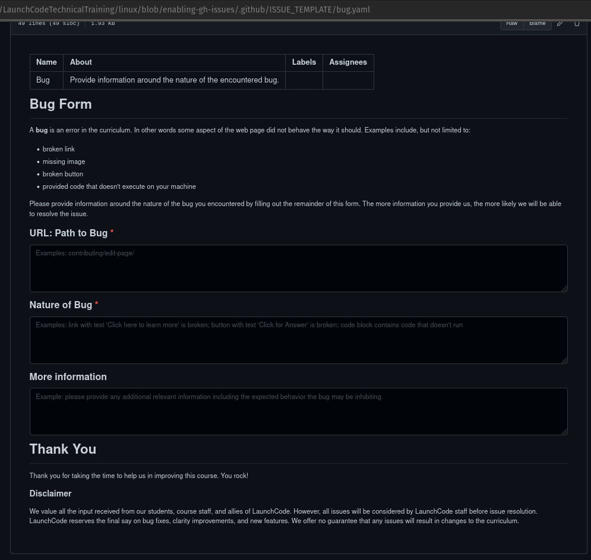
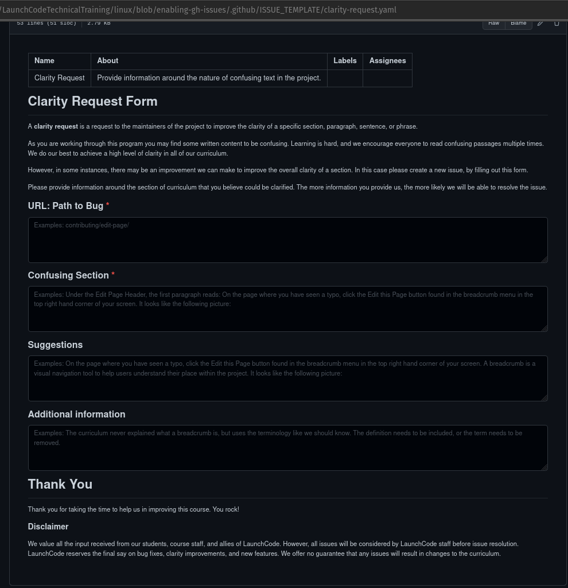
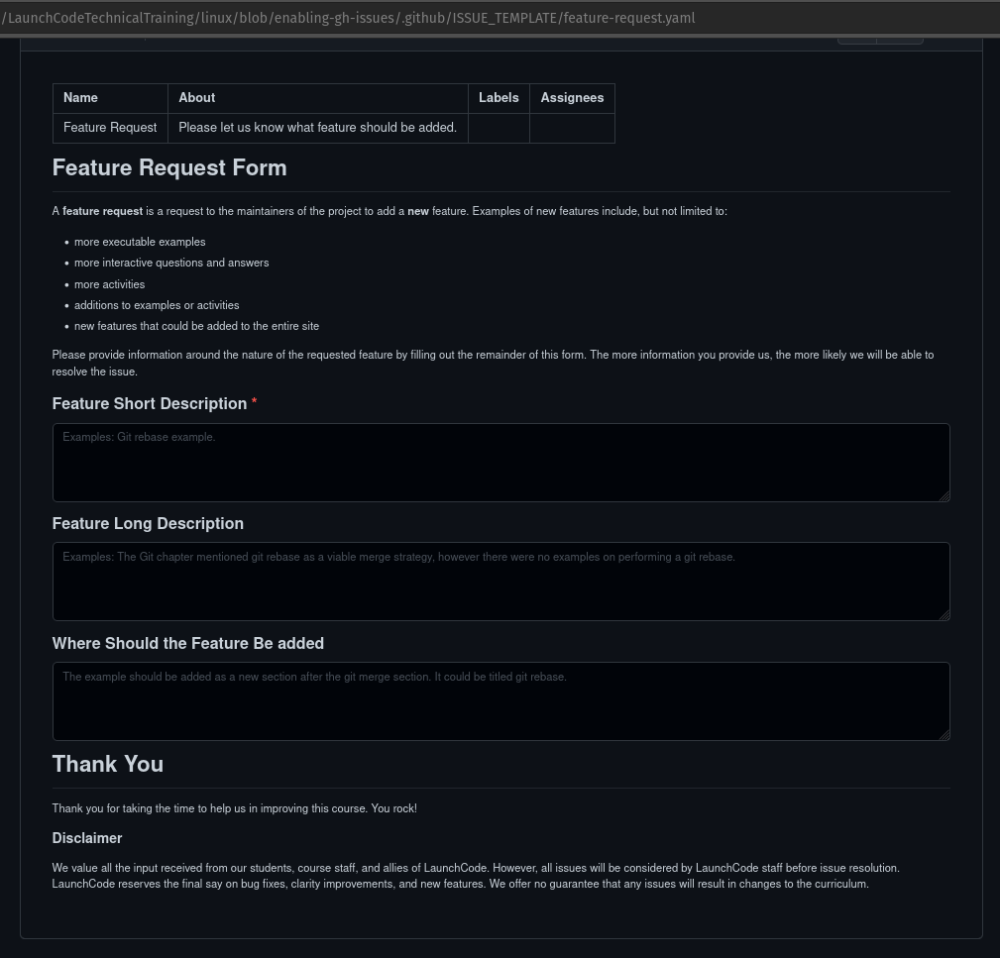

# GitHub Issue Templates

Recently, GitHub added the ability to configure templates for GH issues.

By simply writing some YAML you can build interactive forms, that individuals can use to create new GH issues. In filling out the form the individuals are guided in creating meaningful issues.

These templates are a powerful tool in gathering and implementing feedback from students, course staff, and general do-gooders.

## Usage

### Installation

You can use the templates in this repository by copying the `ISSUE_TEMPLATE` directory into your project's root level `.github` directory (create a new one if it doesn't exist).

So at the root of your project you would have:

- a new directory: `.github/ISSUE_TEMPLATE`
- bug issue form: `.github/ISSUE_TEMPLATE/bug.yaml`
- clarity request form: `.github/ISSUE_TEMPLATE/clarity-request.yaml`
- feature request form: `.github/ISSUE_TEMPLATE/feature-request.yaml`

After committing these files in the `.github/ISSUE_TEMPLATE/` directory you can view a representation of the rendered forms directly on GitHub:

#### Example Pictures

Bug Form rendering on GitHub:

Clarity Request rendering on GitHub:

Feature Request Form rendering on GitHub:

### GitHub Configuration

<!-- TODO: determine if there is any configuration necessary after installing the templates into the correct location.

If so write a little blurb about the work necessary. Include pictures.

If not remove this section completely.

-->

### Issue Creation Experience

<!-- TODO: create a little blurb, with pictures explaining how general population can use these forms to generate meaningful issues. -->

## New Issue Templates

You can create your own issue templates. Right now they only support YAML, but it's a pretty lightweight markup language.

You are more than welcome to look at the provided examples here to create your own Issue forms, or even better checkout the [GitHub Community: Issue Template Guide](https://gh-community.github.io/issue-template-feedback/structured/). It should explain everything that is supported.

When this README was created GH Issue Teamplates were at the end of their Beta, and so many new features may exist now.
